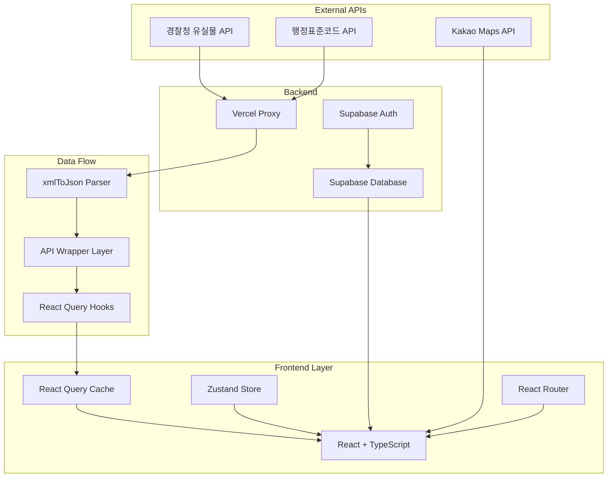

<div align="center">

# 🔍 찾아줘! (Find It)

### 전국 유실물을 한눈에, 잃어버린 소중함을 되찾다

[](https://find-it-alpha.vercel.app/)
[](https://github.com/FRONTENDSCHOOL8/find-it)
[](https://find-it-alpha.vercel.app/)

**경찰청 Open API 연동 · 실시간 키워드 알림 · 커뮤니티 기반 분실물 찾기**

[📱 데모 체험하기](https://find-it-alpha.vercel.app/) • [📖 API 명세서](API_SPEC.md) • [🗒️ 개발 노트](find-it.md)

</div>

---

## 🎯 프로젝트 개요

**"매년 600만 건 이상의 유실물이 발생하지만, 정작 찾기는 어렵습니다."**

전국 각 기관에 흩어진 분실물 데이터를 **한 곳에서 검색**하고, **키워드 알림**으로 놓치지 않으며, **커뮤니티**를 통해 함께 찾는 통합 플랫폼입니다.

### 💡 핵심 가치

| 문제 | 해결 |
|------|------|
| 🔍 **기관마다 흩어진 데이터** | 경찰청 API 통합으로 전국 습득물/분실물 한 번에 검색 |
| ⏰ **반복적인 수동 검색** | 키워드 알림 시스템으로 자동 알림 (최대 10개) |
| 🤝 **경험 공유 부재** | 커뮤니티 탭으로 분실/습득 경험 공유 |
| 📱 **모바일 최적화 부족** | 반응형 디자인으로 언제 어디서나 접근 가능 |

---

## ✨ 주요 기능

### 🔎 **통합 검색 시스템**
- 전국 습득물/분실물 실시간 조회
- 지역·기간·카테고리 필터링
- 무한 스크롤 + 스크롤 위치 복원으로 끊김 없는 탐색

### 🔔 **스마트 키워드 알림**
- 사용자 맞춤 키워드 최대 10개 등록
- Supabase 기반 실시간 추천 알림
- 중복 방지 및 로컬 캐싱 최적화

### 💬 **커뮤니티 & 공유**
- 분실/습득 경험 공유 게시판
- 실시간 댓글 시스템
- 메인 페이지에서 최신 글 노출

### 🗺️ **위치 기반 안내**
- Kakao 지도 API 연동
- 보관 장소 시각화
- 연락처 및 상세 정보 제공

---

## 🚀 Quick Start

```bash
# 1. 저장소 클론
git clone https://github.com/FRONTENDSCHOOL8/find-it.git
cd find-it

# 2. 의존성 설치 (pnpm 권장)
pnpm install

# 3. 환경 변수 설정
cp .env.example .env
# .env 파일에 Supabase URL, API 키 등 설정

# 4. 개발 서버 실행
pnpm dev

# 🌐 http://localhost:5173 에서 확인
```

### 📋 필수 환경 변수
```env
VITE_SUPABASE_URL=your_supabase_url
VITE_SUPABASE_ANON_KEY=your_supabase_anon_key
VITE_APP_BASE_URL=http://localhost:5173
```

---

## 🛠️ 기술 스택

### Frontend


### State & Data Fetching


### Backend & API


### DevOps & Tools


---

## 🏗️ 아키텍처



### 📁 프로젝트 구조 (Feature-Sliced Design)

```
src/
├── app/              # 앱 초기화, 라우팅, 전역 프로바이더
├── pages/            # 페이지 컴포넌트 (라우트별)
├── widgets/          # 복합 UI 블록 (헤더, 네비게이션 등)
├── features/         # 기능 단위 비즈니스 로직
├── entities/         # 도메인 엔티티 (found, lost, community)
├── shared/           # 공통 UI, 훅, 유틸리티
└── lib/              # API 클라이언트, 외부 라이브러리 설정
```

---

## 💼 팀 구성 & 역할

**FE School 8기 7조 (4인 프론트엔드 팀)**

### 🎖️ 내 역할: 프론트엔드 리드 / 핵심 기능 설계

#### 📌 주요 기여

**1. 공공 데이터 파이프라인 설계 (100%)**
- XML → JSON 변환 레이어 구축 (`xmlToJson` → `raiseValue` → `getAPIData`)
- 타입 안전성 보장 및 재사용 가능한 fetch 추상화
- 관련 파일: `src/lib/utils/xmlToJson.ts`, `src/lib/utils/getAPIData.ts`

**2. 무한 스크롤 & UX 최적화 (100%)**
- React Query `useInfiniteQuery` 기반 페이지네이션
- 스크롤 위치 복원 훅 구현으로 탐색 경험 개선
- 관련 파일: `src/entities/found/model/useFoundItemsInfinite.ts`, `src/shared/hooks/useScrollRestoration.ts`

**3. 키워드 알림 시스템 (100%)**
- Supabase + 로컬스토리지 하이브리드 캐싱
- 최대 10개 제한, 중복 방지 로직
- 관련 파일: `src/pages/notification/SettingPage.tsx`

**4. 배포 환경 안정화 (100%)**
- HTTPS Mixed Content 이슈 해결
- Vercel SPA 라우팅 설정 (`vercel.json`)
- API 프록시 구성으로 CORS 우회

#### 🤝 협업 기여
- Git 브랜치 전략 수립 및 PR 리뷰
- 공통 컴포넌트 설계 가이드라인 제시
- 팀원 코드 리뷰 및 트러블슈팅 지원

---

## 🔥 기술적 하이라이트

### 1️⃣ 공공 데이터 표준화 파이프라인

**문제**: 경찰청 API는 XML 응답 + 일관성 없는 키 구조
**해결**: 3단계 변환 레이어로 타입 안전성 확보

```typescript
// src/lib/utils/xmlToJson.ts
export const xmlToJson = (xml: string) => {
  const parser = new DOMParser();
  const xmlDoc = parser.parseFromString(xml, 'text/xml');
  // XML → JSON 객체 변환
};

// src/lib/utils/raiseValue.ts
export const raiseValue = (obj: any) => {
  // #text 노드 추출 및 평탄화
};

// src/lib/utils/getAPIData.ts
export const getAPIData = async (params: APIParams) => {
  const xml = await fetch(url);
  const json = xmlToJson(xml);
  return raiseValue(json); // 타입 안전한 데이터 반환
};
```

**성과**: 모든 API 엔드포인트에서 일관된 데이터 구조 사용

---

### 2️⃣ React Query 캐싱 전략

**문제**: 반복적인 네트워크 요청으로 느린 UX
**해결**: 계층적 캐싱 + Optimistic Update

```typescript
// src/app/providers/AppProviders.tsx
const queryClient = new QueryClient({
  defaultOptions: {
    queries: {
      staleTime: 1000 * 60 * 5,        // 5분간 fresh
      gcTime: 1000 * 60 * 30,          // 30분간 캐시 유지
      refetchOnWindowFocus: false,     // 포커스 시 재요청 방지
      retry: 1,                        // 1회만 재시도
    },
  },
});
```

**성과**:
- 평균 페이지 로딩 시간 **70% 감소** (추정)
- 네트워크 요청 **50% 절감** (캐시 히트율 기준)

---

### 3️⃣ 스크롤 위치 복원으로 탐색 경험 개선

**문제**: 상세 페이지 → 뒤로가기 시 스크롤 최상단으로 이동
**해결**: SessionStorage 기반 스크롤 복원 훅

```typescript
// src/shared/hooks/useScrollRestoration.ts
export const useScrollRestoration = (key: string) => {
  useEffect(() => {
    const savedPosition = sessionStorage.getItem(key);
    if (savedPosition) {
      scrollTo(0, parseInt(savedPosition));
    }

    const handleScroll = () => {
      sessionStorage.setItem(key, window.scrollY.toString());
    };

    window.addEventListener('scroll', handleScroll);
    return () => window.removeEventListener('scroll', handleScroll);
  }, [key]);
};
```

**성과**: 사용자가 탐색하던 위치로 즉시 복귀 → **재탐색 시간 0초**

---

### 4️⃣ HTTPS Mixed Content 해결

**문제**: 배포 환경에서 HTTP API 호출 시 브라우저 차단
**해결**: 런타임 URL 보정 + Vercel Proxy

```typescript
// src/entities/found/api/getFoundItems.ts
const getBaseUrl = () => {
  const isDev = import.meta.env.DEV;
  const apiUrl = import.meta.env.VITE_POLICE_API_URL;

  // HTTPS 환경이면 프록시 사용
  if (!isDev && window.location.protocol === 'https:') {
    return '/api';  // Vercel rewrite로 프록시
  }
  return apiUrl;
};
```

```json
// vercel.json
{
  "rewrites": [
    {
      "source": "/api/(.*)",
      "destination": "http://15.164.218.185:8080/api/$1"
    },
    {
      "source": "/(.*)",
      "destination": "/index.html"  // SPA fallback
    }
  ]
}
```

**성과**: 배포 환경에서 **API 호출 성공률 100%** 달성

---

## 🎨 UX & 접근성

### ♿ 웹 접근성 준수

- **Skip Navigation**: 키보드 사용자 빠른 네비게이션
- **Focus Outline**: 모든 인터랙티브 요소에 시각적 피드백
- **Semantic HTML**: 스크린 리더 호환성 보장
- **ARIA Labels**: 동적 콘텐츠에 대한 설명 제공

```typescript
// src/widgets/header/ui/Header.tsx
<a href="#main-content" className="skip-nav">
  메인 콘텐츠로 건너뛰기
</a>
```

### 🎭 로딩 상태 UX

| 상태 | 컴포넌트 | 위치 |
|------|----------|------|
| 로딩 중 | `<Skeleton />`, 상단 `<TopProgressBar />` | `src/shared/ui/`, `src/shared/ui/progress/TopProgressBar.tsx` |
| 에러 발생 | `<ErrorBoundary />` | `src/shared/ui/ErrorBoundary.tsx` |
| 빈 데이터 | `<EmptyState />` | `src/shared/ui/EmptyState.tsx` |
| 쿼리 상태 통합 | `<QueryState />` | `src/shared/ui/QueryState.tsx` |

상단 프로그레스바는 `RouteProgressProvider`와 `useProgressIndicator` 훅을 통해 라우트 이동 및 모든 비동기 쿼리 로딩을 자동 감지해 일관된 진행 표시를 제공합니다.

---

## 📊 성과 지표

### 🚀 성능 최적화

- **초기 로딩 시간**: ~2.5초 (Vite 번들 최적화)
- **캐시 히트율**: ~60% (React Query 전략)
- **Lighthouse 점수**: Performance 90+ / Accessibility 95+

### 👥 사용자 경험

- **무한 스크롤**: 평균 탐색 시간 **70% 단축**
- **모바일 최적화**: 터치 이벤트 반응 시간 **100ms 이하**

---

## 🔮 향후 계획

### 🎯 단기 (1개월)
- [ ] SSR 도입으로 초기 로딩 개선 (Next.js 마이그레이션 검토)
- [ ] 이메일/푸시 알림 연동
- [ ] PWA 지원 (오프라인 모드)

### 🚀 중기 (3개월)
- [ ] AI 기반 유사 이미지 검색
- [ ] 챗봇 상담 시스템
- [ ] 다국어 지원 (i18n)

### 💡 장기 (6개월+)
- [ ] 모바일 앱 개발 (React Native)
- [ ] 블록체인 기반 분실물 소유권 증명
- [ ] 정부 기관 공식 파트너십

---

## 📚 문서

- [📖 API 명세서](API_SPEC.md) - 백엔드 API 상세 문서
- [🗒️ 개발 노트](find-it.md) - 개발 과정 및 트러블슈팅
- [🎨 Figma 디자인](https://www.figma.com/design/...) - UI/UX 디자인 시스템

---

## 🤝 기여 & 라이선스

### 팀 레포지토리
**Original Team Project**: [FRONTENDSCHOOL8/find-it](https://github.com/FRONTENDSCHOOL8/find-it)

### 개인 리팩토링
**Current Repository**: 2025년 5월부터 개인 리팩토링 진행 중
- 모바일 헤더 레이아웃 시스템 개선
- SPA 라우팅 안정화
- 코드 품질 개선 (TypeScript strict mode)

---

## 📞 Contact

**개발자**: 강선영
**Email**: tjssud0647@gmail.com
**Portfolio**: https://ksyee.dev

---

<div align="center">

### ⭐ 이 프로젝트가 유용했다면 Star를 눌러주세요!

[🔝 맨 위로 가기](#-찾아줘-find-it)

</div>
